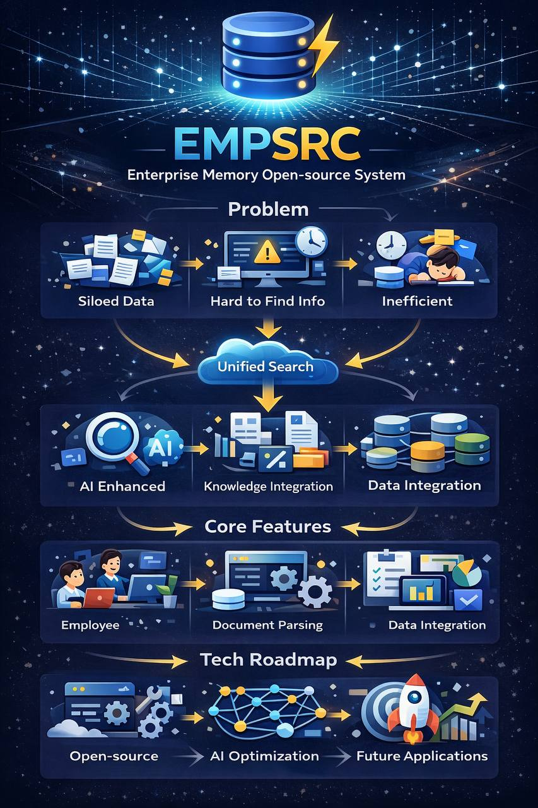

# empsrc

[](https://www.npmjs.com/package/@ckken/empsrc)
[](https://opensource.org/licenses/MIT)

GitHub reference project manager for AI coding agents. Built with Bun + TypeScript.



## 🎯 What is this?

`empsrc` helps you manage reference projects for AI coding agents. Instead of manually cloning repos, it automates:

- ✅ Clone GitHub repos to `refs/` directory
- ✅ Organize by category (frontend/backend/ai/tools)
- ✅ Track versions in `refs/sources.json`
- ✅ Auto-update `AGENTS.md` with project references
- ✅ Auto-add `refs/` to `.gitignore`
- ✅ Search across all reference projects
- ✅ Statistics and insights

Inspired by [opensrc](https://github.com/vercel/opensrc) but for GitHub reference projects instead of npm packages.

## 📦 Installation

```bash
npm install -g @ckken/empsrc
# or
bun install -g @ckken/empsrc
```

## 🚀 Quick Start

```bash
# Initialize in your project
empsrc init

# Add reference projects
empsrc add vercel/next.js --category frontend
empsrc add fastify/fastify --category backend

# List all projects
empsrc list

# Search for code
empsrc search "async function"

# View statistics
empsrc stats

# Update projects
empsrc update
```

## 📖 Commands

### `empsrc init`

Initialize empsrc in current directory.

```bash
empsrc init
empsrc init --force  # Overwrite existing files
```

Creates:
- `refs/` directory
- `.gitignore` with `refs/` excluded
- `AGENTS.md` with reference section
- `refs/sources.json` for tracking

### `empsrc add <repo>`

Add a GitHub repository as reference.

```bash
# Basic usage
empsrc add vercel/next.js

# With category
empsrc add vercel/next.js --category frontend

# With specific branch
empsrc add vercel/next.js --category frontend --branch canary

# Support github: prefix
empsrc add github:vercel/next.js
```

**Options:**
- `-c, --category <category>` - Category (frontend/backend/ai/tools), default: tools
- `-b, --branch <branch>` - Branch or tag to checkout

### `empsrc list`

List all reference projects.

```bash
# List all
empsrc list

# Filter by category
empsrc list --category frontend
```

### `empsrc search <keyword>`

Search for keyword across all reference projects.

```bash
# Search in all projects
empsrc search "async function"

# Search in specific category
empsrc search "useState" --category frontend
```

Uses `ripgrep` if available, falls back to `grep`.

### `empsrc stats`

Show statistics about reference projects.

```bash
# All projects
empsrc stats

# Specific category
empsrc stats --category frontend
```

Shows:
- Projects by category
- Total count
- Recent additions
- Recently updated

### `empsrc update [name]`

Update projects to latest commit.

```bash
# Update all
empsrc update

# Update specific project
empsrc update next.js
```

### `empsrc remove <name>`

Remove a reference project (with confirmation).

```bash
empsrc remove next.js
```

## 📁 Directory Structure

After running `empsrc add`, your project will look like:

```
your-project/
├── refs/
│   ├── frontend/
│   │   └── next.js/          # Cloned repo
│   ├── backend/
│   │   └── fastify/
│   ├── ai/
│   │   └── langchain/
│   ├── tools/
│   │   └── vitest/
│   └── sources.json          # Project metadata
├── AGENTS.md                  # Auto-updated
└── .gitignore                 # Auto-updated
```

## 📝 sources.json Format

`empsrc` tracks all projects in `refs/sources.json`:

```json
{
  "projects": [
    {
      "name": "next.js",
      "repo": "vercel/next.js",
      "category": "frontend",
      "commit": "9b6e563",
      "branch": "main",
      "description": "The React Framework",
      "added": "2026-02-23",
      "updated": "2026-02-24"
    }
  ]
}
```

## 🤖 AGENTS.md Integration

`empsrc` automatically updates your `AGENTS.md` with a reference section:

```markdown
## Reference Projects (refs/)

AI Agent can reference these projects for implementation details:

### Frontend
- **next.js** (`refs/frontend/next.js/`) - vercel/next.js
  The React Framework

### Backend
- **fastify** (`refs/backend/fastify/`) - fastify/fastify
  Fast and low overhead web framework
```

This helps AI coding agents (like Claude, Cursor, Copilot) understand where to find reference implementations.

## 🔧 Categories

- `frontend` - React, Vue, Next.js, Nuxt, etc.
- `backend` - Express, Fastify, NestJS, Django, etc.
- `ai` - LangChain, LlamaIndex, Transformers, etc.
- `tools` - Build tools, testing frameworks, CLI tools, etc.

## 🎯 Use Cases

### For AI Coding Agents

```bash
# Add reference projects for your stack
empsrc add vercel/next.js --category frontend
empsrc add fastify/fastify --category backend
empsrc add langchain-ai/langchainjs --category ai

# AI agents can now reference these implementations
# Search for specific patterns
empsrc search "middleware pattern"
```

### For Learning & Reference

```bash
# Study how popular projects are structured
empsrc add shadcn-ui/ui --category frontend
empsrc add trpc/trpc --category backend

# Search for implementation examples
empsrc search "authentication"
```

### For Team Onboarding

```bash
# Share reference projects with your team
empsrc add your-org/design-system --category frontend
empsrc add your-org/api-gateway --category backend

# New team members can search and learn
empsrc search "error handling"
```

## 🆚 vs opensrc

| Feature | empsrc | opensrc |
|---------|--------|---------|
| Target | GitHub repos | npm packages |
| Use case | Reference projects | Dependency source code |
| Auto-detect | Manual add | Auto from lockfile |
| Categories | frontend/backend/ai/tools | npm/pypi/crates |
| Search | Built-in search | No search |
| Stats | Project statistics | No stats |
| Runtime | Bun/Node.js | Node.js |

## 🛠️ Development

```bash
# Clone repo
git clone https://github.com/ckken/empsrc.git
cd empsrc

# Install dependencies (with Bun)
bun install

# Run tests
bun test

# Build
bun run build

# Test locally
bun run dist/cli.js --version
```

## 🧪 Testing

Built with Bun's native test runner:

```bash
# Run all tests
bun test

# Watch mode
bun test --watch
```

## 📄 License

MIT © Ken

## 🙏 Credits

- Inspired by [opensrc](https://github.com/vercel/opensrc) by Vercel
- Built with [Bun](https://bun.sh)

## 🔗 Links

- [GitHub](https://github.com/ckken/empsrc)
- [npm](https://www.npmjs.com/package/@ckken/empsrc)
- [Issues](https://github.com/ckken/empsrc/issues)

## 📊 What's New in v0.3.0

- ✅ **Rewritten in TypeScript** - Full type safety
- ✅ **Powered by Bun** - Faster runtime and testing
- ✅ **Built-in Search** - Search across all reference projects
- ✅ **Statistics** - View project insights
- ✅ **Init Command** - Easy project setup
- ✅ **Comprehensive Tests** - 14+ test cases with Bun Test
